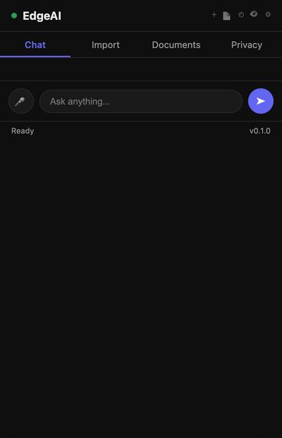

# EdgeAI

A Chrome extension that runs a 3.8B language model, an embedding model, a cross-encoder reranker and speech recognition on your own GPU, inside the browser, and answers questions from your documents. After the one-time model download nothing leaves the machine, and the extension logs its own network requests so you can check that instead of trusting it.



## What it does

- Chat with Phi-4-mini (3.8B, 4-bit, 4K context) over WebGPU. Machines without roughly 3.4 GB of GPU memory get Llama-3.2-1B instead.
- Index an Obsidian vault (File System Access API; the folder handle is remembered), PDFs, text and Markdown files, any open tab (the "Index this tab" button, or right-click → "Index this page with EdgeAI"), and Chrome bookmarks (titles and URLs only).
- Retrieval per question: BM25 top 20 from Orama and cosine top 20 over bge-small embeddings, fused with reciprocal rank fusion, reranked with ms-marco-MiniLM-L-6, and the top 5 go into the prompt tagged `[SOURCE: title, date]`.
- Voice: tap the mic, Moonshine-tiny transcribes on-device, Silero VAD decides when you've stopped talking, and replies can be read back with the browser's speech synthesis.
- Trust Panel: the git commit the build came from, an inventory of everything stored and its size, every network request the extension has made, and an audit log of every retrieval.
- Stealth mode: the same UI in Chrome's side panel, which tab-sharing captures don't include.

## Install

Chrome Web Store: pending review. Until then, from source:

```
git clone https://github.com/kamalkalwa/EdgeAI
cd EdgeAI/extension
npm install
npm run fetch:model-libs   # web-llm's two WebGPU model libraries, ~11 MB, into public/mlc/
npm run build              # → dist/
```

chrome://extensions → Developer mode → Load unpacked → `extension/dist`.

First launch downloads about 2.4 GB of weights from huggingface.co (2.2 GB of it is Phi-4-mini). They go into the browser's Cache API and are not fetched again. There's a progress bar; go make tea.

Needs Chrome 116 or newer with WebGPU on (chrome://gpu should say "WebGPU: Hardware accelerated"). Firefox and Safari aren't supported; this depends on Chrome's offscreen document API.

## How it's built

Manifest V3 gives an extension three places to run code and none of them wants a 2 GB model. The service worker is killed after 30 seconds idle and has no WebGPU. The popup dies when it closes. Content scripts live in someone else's page. So every model runs in an offscreen document — a hidden extension page that Chrome keeps alive while it claims a reason (here: audio playback and microphone) — and the service worker is only a message router. Popup, side panel and content scripts send messages, the worker forwards them, the offscreen document answers and streams tokens back.

Chunking is semantic: sentences grouped in windows of three, each window embedded, a new chunk starts where consecutive windows fall below 0.6 cosine similarity or the chunk passes 1500 characters, with two sentences of overlap. Vector search is brute-force cosine over an in-memory map, which is fine up to tens of thousands of chunks — a big vault. Everything persists in IndexedDB: documents and chunks via Dexie, embeddings plus the BM25 source rows as one JSON blob, the vault handle in its own database.

Retrieved text is untrusted. Chunks are capped at 1200 characters before they enter the prompt and lines opening with `SYSTEM:`, `[INST]`, `<<` and the like are redacted. That blunts the obvious attacks; a hostile note can still steer the model, so look at what you index.

Three things you'll hit if you fork this:

**The CSP.** Extension pages run under `script-src 'self' 'wasm-unsafe-eval'; worker-src 'self'`, and MV3 won't let you loosen it. ONNX Runtime's older WebGPU backend (JSEP, what transformers.js 3 used) bootstrapped through a `blob:` URL and a dynamic `import()`; both are blocked, which is why the first version ran every ONNX model on a single WASM thread. transformers.js 4 moved to ONNX Runtime 1.31, whose WebGPU build loads with a plain same-origin `import()` as long as you stay single-threaded (`proxy = false`, `numThreads = 1`) and point `wasmPaths` at a copy of the runtime inside the package (`dist/ort/`). Embeddings now run on the GPU with a WASM fallback; the reranker and VAD stay on WASM on purpose — int8 gains nothing there and they'd contend with the LLM for the GPU.

**Remote code.** The Web Store forbids executing code the package didn't ship. web-llm's default config fetches each model's compiled WebGPU library, a `.wasm`, from GitHub at runtime. `npm run fetch:model-libs` downloads the two libraries and writes their URLs and SHA-256 hashes to `public/mlc/libs.json`; at startup the offscreen document copies the bundled bytes into web-llm's cache under the URL web-llm expects, so the download never happens. The build fails if the bundled files don't match the installed web-llm version.

**Keepalive.** A content script on every tab pings the service worker every 25 seconds. That's the whole trick, and it's the same trick every MV3 extension with long-running work ends up using.

Longer version, including the things that went wrong: [docs/writeup-local-ai-in-chrome-mv3.md](docs/writeup-local-ai-in-chrome-mv3.md).

## Privacy

Full policy: https://kamalkalwa.github.io/EdgeAI/privacy.html. No server, no account, no telemetry, no analytics. The only requests are the weight downloads from huggingface.co on first run. The Trust Panel's network log records what the extension itself requested and nothing else — requests from the sites you visit are never observed. Settings → Clear All Data drops every database; Delete Downloaded Models empties the model cache.

## Development

```
npm run dev          # vite build --watch; reload in chrome://extensions
npm run type-check
npm test             # 78 unit tests: chunker, RRF, retrieval, stores (fake-indexeddb), connectors, network log
npm run build:store  # production build + zip; commit first, the Trust Panel shows the build's git hash
```

`src/background` is the service worker, `src/offscreen` all inference, `src/popup` the UI (one module per tab), `src/lib` retrieval / storage / connectors / voice / trust, `src/content` page extraction and keepalive. Design notes are in `docs/` (TECHNICAL.md is the long one).

## Known limits

- Phi-4-mini reads its five chunks well and is a modest general assistant. 4K context: a long document is only ever seen five chunks at a time.
- No model picker; the choice is made from GPU memory at startup.
- Indexing the same PDF, text file or vault twice stores it twice. Tabs are deduplicated by URL.
- Indexing a large vault takes a while even on the GPU; embeddings are computed one document at a time on purpose (a queue keeps the WebGPU worker from running out of memory). There's a progress bar.
- Bookmark import indexes titles and URLs, not page contents.

## License

MIT. Copyright (c) 2026 Kamal Kalwa.
